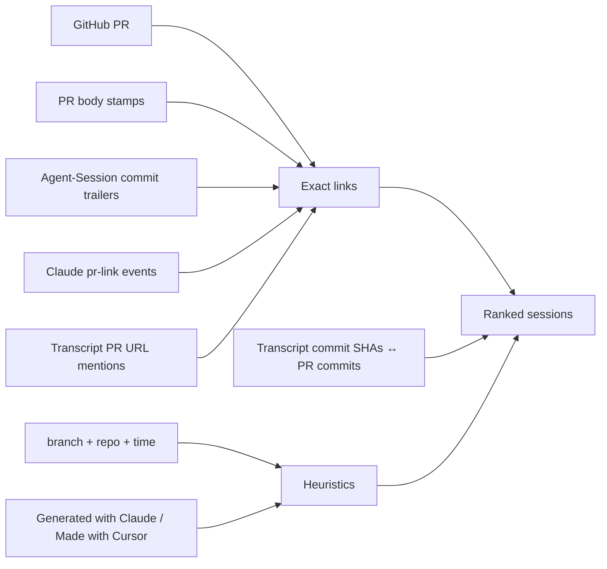

# pr-session

You open a PR and later wonder which Claude Code, Codex, or Cursor session actually produced it. The agents leave soft fingerprints (`Generated with Claude Code`, `Made with Cursor`), and Claude even keeps local `pr-link` metadata, but nothing ties those threads together across tools. **pr-session** is a small local CLI (and library) that indexes the transcripts on your machine and lets you go PR → session and session → PR.

v0.1 is meant to be cloned and run from source. It is not on npm yet, so `npx` / global install will not resolve until you publish.

## Getting started

You need Node 20+, an authenticated GitHub CLI (`gh auth login`) for `lookup` / `open`, and whatever agent transcript dirs you already have under `~/.claude`, `~/.codex`, and `~/.cursor`.

```bash
git clone https://github.com/daviskeene/pr-session.git
cd pr-session
npm install
npm run build
npm link   # optional
```

Without linking, prefix commands with `npm run pr-session --`.

Index once, then ask about a PR:

```bash
pr-session index
pr-session lookup https://github.com/org/repo/pull/123
```

For future PRs, stamp the session id into the description so the next lookup is exact:

```bash
pr-session stamp --agent claude --id "$SESSION_ID"
# paste the markdown block into the PR body
```

Session ids usually fall out of `lookup` itself. If you need to dig: Claude’s `sessionId` (and the `.jsonl` filename) under `~/.claude/projects/`, Codex’s UUID in `~/.codex/sessions/**/rollout-*-<uuid>.jsonl`, Cursor’s folder under `~/.cursor/projects/<project>/agent-transcripts/<uuid>/`. Worked stamp and JSON lookup samples live in [`examples/`](examples/).

## Commands

```bash
pr-session index [--json] [--full]
pr-session lookup <pr> [--json] [--open] [--n <k>] [--verbose] [--min exact|high|medium|low] [--no-heuristic]
pr-session list [--repo <owner/repo|name>] [--agent <claude|codex|cursor>] [--since <7d|24h|ISO>] [--limit <n>] [--json]
pr-session session <agent/id|id> [--json] [--open]   # id may be a unique prefix (≥6 chars)
pr-session stamp --agent <claude|codex|cursor> --id <sessionId> \
  [--cloud-url <url>] [--title <t>] [--trailers|--token]
pr-session open <pr> [--n <k>]   # resume/open a match (best by default); PR_SESSION_NO_OPEN=1 to print only
pr-session stats
pr-session help
```

`<pr>` can be a full GitHub URL, `owner/repo#123`, or a bare number (uses `gh` against the current repo). Prefer `--min exact` when you only want Claude `pr-link` events and body stamps; `--no-heuristic` drops branch/time/fingerprint matching.

`index` keeps a per-file scan cache at `~/.pr-session/cache.json`, so re-runs only read transcripts that changed (a full rescan of a big tree takes seconds; a cached one takes milliseconds). `--full` ignores the cache. `list` browses the index without needing a PR — "what was I doing in this repo yesterday" is `pr-session list --repo myrepo --since 1d`, and each row prints its resume command.

## Opening a matched session

`lookup` prints compact numbered match rows (confidence, agent + short id, branch, last active) and — on an interactive terminal — ends with a picker: type a match number to resume it, Enter to skip. `--verbose` restores full per-match detail (paths, view URLs, resume commands), and `--json` is unchanged. `pr-session open <pr>` (or `lookup` / `session` with `--open`) **runs** the best match, and `--n 2` picks any match by its row number:

| Agent | Action |
| --- | --- |
| Claude Code | runs `claude --resume <id>` (from the session cwd when known) |
| Codex | runs `codex resume <id>` |
| Cursor cloud (`bc-…`) | opens `https://cursor.com/agents/bc-…` |
| Cursor local (Agent ID UUID) | opens `cursor://anysphere.cursor-deeplink/agent?id=<uuid>` (same id as **Copy Agent ID**) |
| Fallback | opens the transcript JSONL |

```bash
pr-session lookup 17533
#   1  exact  claude:be04ee9a  main  Aug 7
#   2  high   codex:019f8676   main  Jul 21
# Open which? [1-2, Enter to skip]:

pr-session open 17533              # runs the best match's resume
pr-session open 17533 --n 2        # runs match #2 instead
pr-session session claude/be04ee9a --open   # short ids from the rows resolve as prefixes
```

Bugbot’s `https://cursor.com/open?link=…` URLs are a different payload (encrypted fix data), not a general open-by-agent-id link. Local Cursor chats still have no shareable `https://` URL for reviewers — the deeplink only works on a machine that already has the chat.

## How matching works

Exact hits come first: Claude Code’s `pr-link` transcript events, `agent-session://…` tokens from `stamp` in the PR body, and `Agent-Session:` git trailers read back from the PR’s commit messages. Just below exact, commit-SHA matching: the indexers harvest commit SHAs from transcripts (git’s `[branch abc1234]` commit output, Codex `session_meta` git state) and match them against the PR’s commit list — high confidence with zero user effort. Medium-confidence signals include PR URLs mentioned in a transcript, and the usual branch + repo (+ time window) heuristics, sometimes narrowed by soft body fingerprints like “Generated with Claude Code.” Stamp going forward when you care about a clean reverse path later.



## Where this sits next to vendor tools

Claude’s `--from-pr` already resumes the linked local Claude session. Copilot’s cloud agent puts a session-log URL on every agent commit. Cursor Cloud gives you shareable `cursor.com/agents/…` runs. Those are great inside one product.

pr-session is for the day you bounced between Claude, Codex, and local Cursor and want one index keyed by PR. It does not replace those vendor flows. Local IDE Cursor chats still have no first-party PR join (that is a lot of why this exists); once you have the Agent ID, Cursor’s own `cursor://…/agent?id=` deeplink is enough to jump back into the chat.

## Privacy

Most transcripts should stay on your laptop. The index at `~/.pr-session/index.json` stores ids, paths, branches, and repo guesses, not full chat logs. A plain `stamp` only puts a token and a “transcript is local” note on the PR if you paste it. Add `--cloud-url` when you actually want reviewers to open a shareable run. Never paste raw `*.jsonl` into GitHub.

## Library layout

Resolve, stamp, and types are filesystem-free and safe to import from an Action. Local indexing and the `gh` helper are author-machine adapters.

```ts
import { resolveSessionsForPr } from "pr-session/resolve";
import { buildStamp, extractStampTokens } from "pr-session/stamp";
import { buildIndex, loadIndex } from "pr-session/local"; // author machine only
```

| Import | What you get |
| --- | --- |
| `pr-session/resolve` | PR ↔ session matching |
| `pr-session/stamp` | stamp builders / token parsers |
| `pr-session/types` | shared types |
| `pr-session/local` | `buildIndex` / `loadIndex` (local FS) |
| `pr-session/github` | `fetchPrMeta` via local `gh` |
| `pr-session` | convenience barrel for the CLI |

A sketch of a future Action that only surfaces cloud stamps is in [`examples/github-action.md`](examples/github-action.md).

## Data sources

Claude lives at `~/.claude/projects/**/*.jsonl` (`pr-link`, `sessionId`, `gitBranch`, `cwd`). Codex rollouts are under `~/.codex/sessions/**/*.jsonl` with useful `session_meta` git fields. Cursor chats are under `~/.cursor/projects/*/agent-transcripts/**/*.jsonl`. The index lives at `~/.pr-session/index.json`, the per-file scan cache at `~/.pr-session/cache.json`.

## When something looks wrong

If there is no index, run `pr-session index`. Empty matches usually mean you need to re-index after the agent run, drop `--min exact`, or confirm the transcript dirs above actually have files. A `gh unavailable` warning means auth is missing or you should pass a full PR URL. Cursor hits that resolve into `empty-window` should improve after a fresh index (v0.1 prefers real project dirs). Lookup working on your machine and nowhere else is expected: local transcripts do not travel with the PR. Noisy heuristics are a good reason for `--min exact` / `--no-heuristic`, and for stamping next time.

While we are on `0.x`, minor bumps may break APIs. See [CHANGELOG.md](CHANGELOG.md). MIT license, Copyright (c) 2026 Davis Keene.
