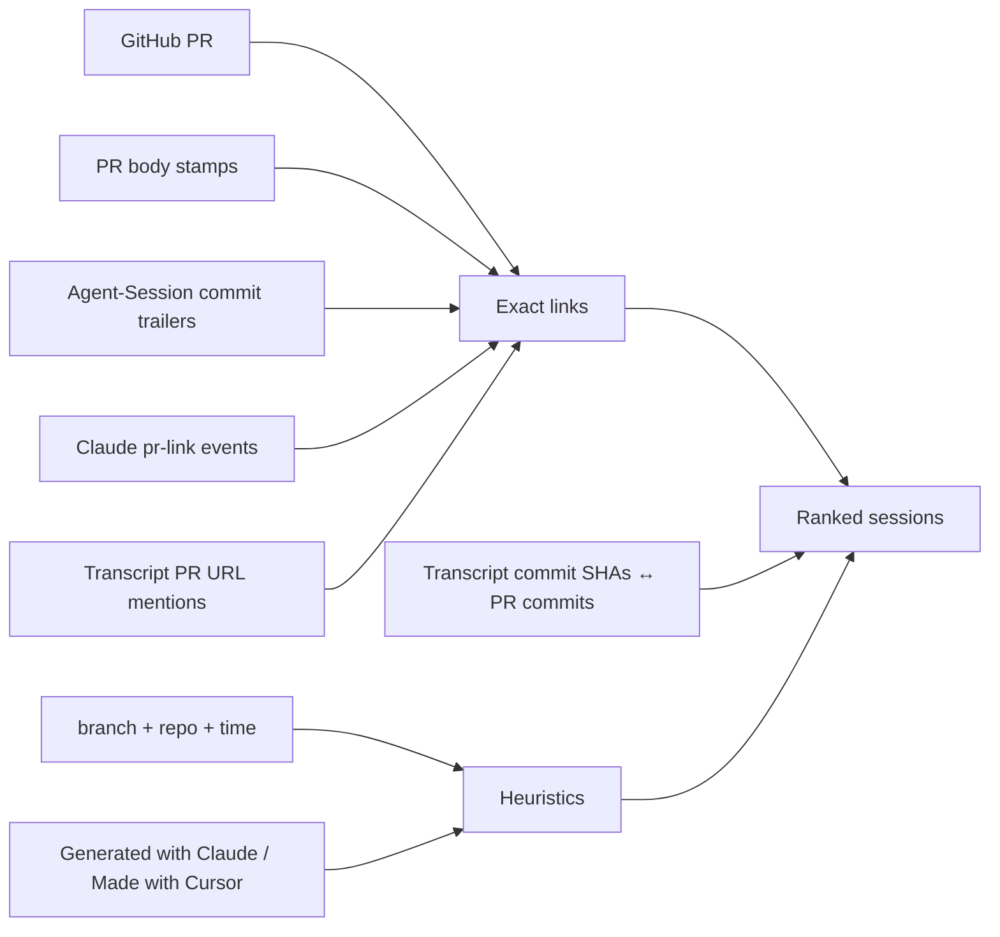

# pr-session

This is a small local CLI (and library) that indexes the cursor, claude code, and codex transcripts on your machine and links GitHub PRs to agent sessions, in both directions. It's never been quicker to go from open PR to the agent transcript that produced it, across all your favorite coding agents.

It's local-first, meaning that all indexes are created and stored on your local machine. Currently only supports Cursor, Claude Code, and Codex/ChatGPT App.

## Getting started

You need Node 20+, an authenticated GitHub CLI (`gh auth login`), and whatever transcripts already live under `~/.claude`, `~/.codex`, and `~/.cursor`.

```bash
git clone https://github.com/daviskeene/pr-session.git
cd pr-session
npm install
npm run build
npm link   # optional
```

Without `npm link`, prefix commands with `npm run pr-session --`.

Build the index once, then ask about a PR:

```bash
pr-session index
pr-session lookup https://github.com/org/repo/pull/123
```

For future PRs, stamp the session id into the description so the next lookup is exact:

```bash
pr-session stamp --agent claude --id "$SESSION_ID"
# paste the markdown block into the PR body
```

Session ids usually come from `lookup` itself. If you need to dig, they live here:

- Claude: the `sessionId` (and `.jsonl` filename) under `~/.claude/projects/`
- Codex: the UUID in `~/.codex/sessions/**/rollout-*-<uuid>.jsonl`
- Cursor: the folder name under `~/.cursor/projects/<project>/agent-transcripts/`

Worked stamp and lookup samples live in `[examples/](examples/)`.

## Commands

```bash
pr-session index [--json] [--full]
pr-session lookup <pr> [--json] [--open] [--n <k>] [--verbose] [--min exact|high|medium|low] [--no-heuristic]
pr-session list [--repo <owner/repo|name>] [--agent <claude|codex|cursor>] [--since <7d|24h|ISO>] [--limit <n>] [--json]
pr-session session <agent/id|id> [--json] [--open]   # id may be a unique prefix (≥6 chars)
pr-session stamp --agent <claude|codex|cursor> --id <sessionId> \
  [--cloud-url <url>] [--title <t>] [--trailers|--token]
pr-session open <pr> [--n <k>]   # resume/open a match; PR_SESSION_NO_OPEN=1 to print only
pr-session stats
pr-session help
```

`<pr>` can be a GitHub URL, `owner/repo#123`, or a bare number (which uses `gh` against the current repo). `--min exact` returns only exact links, and `--no-heuristic` drops branch, time, and fingerprint matching.

`index` keeps a scan cache at `~/.pr-session/cache.json`, so re-runs only read transcripts that changed. `--full` ignores the cache.

`list` browses the index without a PR. "What was I doing in this repo yesterday" is:

```bash
pr-session list --repo myrepo --since 1d
```

Every row prints its own resume command.

## Opening a matched session

`lookup` prints numbered matches: confidence, agent, short id, branch, last activity. In an interactive terminal it ends by asking which one to open; Enter skips. `--verbose` shows full paths and resume commands, and `--json` gives structured output.

`pr-session open <pr>` runs the best match. So do `lookup --open` and `session --open`. Pick a different match with `--n 2`.


| Agent                        | Action                                                        |
| ---------------------------- | ------------------------------------------------------------- |
| Claude Code                  | runs `claude --resume <id>` (from the session cwd when known) |
| Codex                        | runs `codex resume <id>`                                      |
| Cursor cloud (`bc-…`)        | opens `https://cursor.com/agents/bc-…`                        |
| Cursor local (Agent ID UUID) | opens `cursor://anysphere.cursor-deeplink/agent?id=<uuid>`    |
| Fallback                     | opens the transcript JSONL                                    |


```bash
pr-session lookup 17533
#   1  exact  claude:be04ee9a  main  Aug 7
#   2  high   codex:019f8676   main  Jul 21
# Open which? [1-2, Enter to skip]:

pr-session open 17533              # runs the best match's resume
pr-session open 17533 --n 2        # runs match #2 instead
pr-session session claude/be04ee9a --open   # short ids resolve as prefixes
```

Bugbot's `https://cursor.com/open?link=…` URLs carry encrypted fix data, not an open-by-agent-id link. Local Cursor chats have no shareable web URL at all; their deeplinks only work on a machine that already has the chat.

## How matching works

Exact matches come first: Claude's `pr-link` events, `agent-session://` stamps in the PR body, and `Agent-Session:` trailers in the PR's commit messages.

Just below exact sits commit-SHA matching. When a session actually creates a commit, git prints the SHA, the indexers pick it up from the transcript, and the resolver compares it against the PR's commit list. You get a high-confidence match without doing anything.

The rest is heuristics: PR URLs mentioned in a transcript, branch + repo + time windows, and soft body fingerprints like "Generated with Claude Code". Stamp when you want a clean reverse path later.




## Where this sits next to vendor tools

Claude's `--from-pr` resumes the linked local Claude session. Copilot's cloud agent stamps a session-log URL on its commits. Cursor Cloud gives you shareable `cursor.com/agents/…` runs. All useful, all single-product.

pr-session is for the day you bounced between all three and want one index keyed by PR. Local IDE Cursor chats have no first-party PR join at all (a lot of why this exists); once you have the Agent ID, Cursor's own deeplink jumps back into the chat.

## Privacy

The index at `~/.pr-session/index.json` stores ids, paths, branches, and repo guesses. It doesn't store any transcript logs. A plain `stamp` puts a token and a "transcript is local" note on the PR, and only if you paste it there yourself. Add `--cloud-url` when you actually want reviewers to open a shareable run. Never paste raw `*.jsonl` into GitHub.

## Library layout

Resolve, stamp, and types never touch the filesystem, so they are safe to import from a GitHub Action. Local indexing and the `gh` helper run on the author's machine.

```ts
import { resolveSessionsForPr } from "pr-session/resolve";
import { buildStamp, extractStampTokens } from "pr-session/stamp";
import { buildIndex, loadIndex } from "pr-session/local"; // author machine only
```


| Import               | What you get                          |
| -------------------- | ------------------------------------- |
| `pr-session/resolve` | PR ↔ session matching                 |
| `pr-session/stamp`   | stamp builders / token parsers        |
| `pr-session/types`   | shared types                          |
| `pr-session/local`   | `buildIndex` / `loadIndex` (local FS) |
| `pr-session/github`  | `fetchPrMeta` via local `gh`          |
| `pr-session`         | convenience barrel for the CLI        |


A sketch of a future Action that surfaces only cloud stamps is in `[examples/github-action.md](examples/github-action.md)`.

## Data sources

Claude: `~/.claude/projects/**/*.jsonl` (`pr-link`, `sessionId`, `gitBranch`, `cwd`). Codex: `~/.codex/sessions/**/*.jsonl`, whose `session_meta` carries branch and repo. Cursor: `~/.cursor/projects/*/agent-transcripts/**/*.jsonl`.

The index lives at `~/.pr-session/index.json`, the scan cache at `~/.pr-session/cache.json`.

---

See [CHANGELOG.md](CHANGELOG.md) for updates.

MIT license, Copyright (c) 2026 Davis Keene.